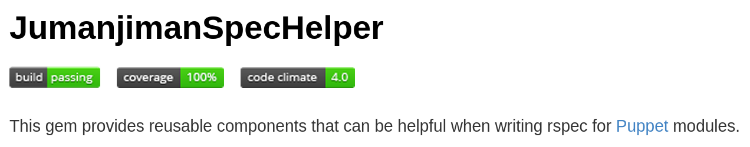

<!SLIDE title transition=shuffle>
# Our patterns

<!SLIDE bullets small transition=toss>
# Transparency

* Everybody can access Github repos
* Everybody can access the Puppet Enterprise Console
  - read-only user: `puppet.console@ise.com`
  - read-only pass: `password`

### (By everybody, I mean employees, vendors, consultants)

<!SLIDE bullets small transition=toss>
# Common rspec
  - ISE patterns (multi-os, etc.)
  - Well-formed XML and YAML
  - File checks (syntax and style)
  - 30 minutes per run for the full tree
  - 23,500+ unit tests

<!SLIDE bullets smaller transition=toss>
# Smoke-test

Run one of the following commands to test a branch:

    @@@ shell
    host-enforce.sh -b <branch-name>

or:

    @@@ shell
    export branch=<branch-name>
    puppet agent --ignorecache --no-usecacheonfailure --color False \
    --pluginsync --no-daemonize --onetime --logdest console \
    --ignorecache --no-usecacheonfailure --splay --splaylimit 10 \
    --show_diff --server puppet.inf.ise.com --graph \
    --environment $branch 2>&1 | tee /tmp/ringo.log

<!SLIDE bullets smaller transition=toss>
# Host impersonation pattern
* Use case: I want to test a change that should apply to **prod** nodes

Hack change like normal, then choose a test host and run:

    @@@ shell
    export ISE_MOCK_FQDN=pc-dd01b.prod.ise.com
    host-enforce.sh -b <name_of_your_branch>

* Notes
  - Test host receives a catalog that resembles pc-dd01b.prod.ise.com
  - `$::ise_mock_fqdn` enables one host to impersonate another for smoke tests
  - Works during build!

<!SLIDE bullets smaller transition=toss>
# Node classification and host impersonation

* Two categories of node facts
  - `ise_mock_*`: *impersonated* version of a fact
  - `ise_real_*`: *real* version of a fact

* Benefits
  - No impact on SSL certificates
  - Enterprise console correctly reports runs for both
    the test host and the real production host

* Exceptions
  - network module (would break network)
  - authconfig module (would break Kerberos)

<!SLIDE bullets smaller transition=toss>
# Real facts
## Example on **ic-vcs01.inf.ise.com**

    @@@
    fqdn                  => ic-vcs01.inf.ise.com
    ise_real_conforms     => yes
    ise_real_environment  => i
    ise_real_site         => c
    ise_real_function     => vcs
    ise_real_sequence     => 01
    ise_real_hostname     => ic-vcs01
    ise_real_domain       => inf.ise.com
    ise_real_host_realm   => INF.ISE.COM
    ise_real_user_realm   => PROD.ISE.COM

<!SLIDE bullets smaller transition=toss>
# Mock facts
## `$::ise_mock_fqdn` is the core fact upon which all others are based

    @@@
    export ISE_MOCK_FQDN='pc-amq01a.prod.ise.com'

    # impersonated facts (do not use in authconfig or network modules)
    ise_mock_fqdn         => pc-amq01a.prod.ise.com
    ise_mock_conforms     => yes
    ise_mock_environment  => p
    ise_mock_site         => c
    ise_mock_function     => amq
    ise_mock_sequence     => 01
    ise_mock_cluster_node => a
    ise_mock_hostname     => pc-amq01a
    ise_mock_domain       => prod.ise.com
    ise_mock_host_realm   => PROD.ISE.COM
    ise_mock_user_realm   => PROD.ISE.COM

<!SLIDE bullets smaller transition=toss>
# The root of classification

    @@@ ruby
    module Ise
      class Helper
        def self.ise_mock_fqdn
          ( kernel_value('ISE_MOCK_FQDN') || # 1st choice
            ENV['ISE_MOCK_FQDN'] ||          # 2nd choice
            Facter.value(:fqdn)              # last resort
          ).to_s.downcase
        end

        def self.proc_cmdline
          (File.read '/proc/cmdline' rescue nil).to_s
        end

        def self.kernel_value(key)
          # return nil if 'key=.*' is not in /proc/cmdline
          f = proc_cmdline.grep(/\b#{key}=[^\b]*/).first
          f.split('=').last if f
        end
      end
    end
    Facter.add(:ise_mock_fqdn) do
      setcode {Ise::Helper.ise_mock_fqdn}
    end

<!SLIDE bullets smaller transition=toss>
# Hiera hierarchy

    @@@ yaml
    gts/%{::operatingsystem}
    gts/%{::lsbmajdistrelease}/%{core_ver}
    rhel/%{::lsbdistrelease}
    rhel/%{::lsbmajdistrelease}/ib/%{ib_ver}
    rhel/%{::lsbmajdistrelease}
    iseapps/%{::ise_asg}/%{iseapps_name}
    common/%{::ise_asg}/ise_mock_hostname/%{::ise_mock_hostname}
    common/%{::ise_asg}/ise_mock_function/%{::ise_mock_function}
    common/%{::ise_asg}/%{::ise_asg}
    common/ise_mock_hostname/%{::ise_mock_hostname}
    common/ise_mock_function/%{::ise_mock_function}
    common/ise_mock_environment/%{::ise_mock_environment}/%{::ise_mock_site}
    common/ise_mock_environment/%{::ise_mock_environment}
    common/ise_mock_site/%{::ise_mock_site}
    common/ise_mock_host_realm/%{::ise_mock_host_realm}
    common/%{::operatingsystem}
    common/%{::kernel}
    common

<!SLIDE bullets smaller transition=toss>
# Configure rspec for hiera
## `spec_helper.rb`

    @@@ ruby
    require 'rspec-hiera-puppet'
    module Helpers
      extend RSpec::SharedContext
        def hiera_config_file
          h_config = YAML.load_file(
            File.join(
            repo_root,'modules','puppet','files','configs','hiera.yaml'
            )
          )
          h_config[:yaml][:datadir] = File.join(repo_root,'hieradata')
          h_config
        end
      let(:hiera_config) { hiera_config_file }
    end

    RSpec.configure do |c|
      c.include Helpers
      # --snip--
    end

<!SLIDE bullets small transition=toss>
# Check hiera patterns

    @@@ puppet
    class foo::bar {
      $pkgs = hiera('foo_pkgs', [])
      package {$pkgs: ensure => latest}
    }

____

    @@@ ruby
    # hieradata/common/ise_mock_function/fake.yaml
    foo_pkgs:
      - bar

____

    @@@ ruby
    describe 'foo::bar' do
      let(:facts) {{:ise_mock_function => 'fake'}}
      it {should contain_package('bar')}
    end

<!SLIDE bullets small transition=toss>
# Delivery vs. deployment

* Continuous delivery + host-enforce in prod
* Continuous deployment everywhere else

<!SLIDE bullets small transition=toss>
# Sticky branches
### Dynamic environments

* Prod always uses production branch
* The expected state as of *now* (no git tags)
* All other environments *remember* current branch

<!SLIDE bullets smaller transition=toss>
# Sticky branches

    @@@ puppet
    $config_environment  = hiera('sticky_branch', 'production')

____

    $ grep -r sticky hieradata/*
    hieradata/common/ise_mock_environment/p/c.yaml:sticky_branch: production
    hieradata/common.yaml:sticky_branch: "%{::environment}"
____

    @@@ ruby
    # puppet.agent.conf.erb
    [agent]
    environment = <%= config_environment %>

<!SLIDE bullets small transition=toss>
# site.pp
### `site.pp` is dead; long live `site::pp`!

    @@@ puppet
    if $::kernel == Linux {
      # default path for exec's (global scope)
      Exec { path => '/usr/bin:/usr/sbin:/bin:/sbin' }
    }

    if $::kernel == windows {
      # default path for exec's (global scope)
      Exec { path => $::path }
      Package { provider => 'chocolatey' }
    }

    node default {
      # Classes should now be included from site::pp
      # since rspec-puppet cannot test site.pp
      include site
    }

<!SLIDE bullets small transition=toss>
# Check site.pp is static

    @@@ ruby
    describe 'site.pp' do
      let(:md5sum) { 'f7024f854caf6880f1a56397b4d50f5a' }
      it 'should have the correct md5sum' do
        Digest::MD5.hexdigest(File.read('site.pp')).should == md5sum
      end
    end

<!SLIDE bullets small transition=toss>
# The "one system" pattern
### Every node gets every module

    @@@ puppet
    class site::pp {
      include stdlib
      include iselib

      $setup_modules = [
        foo,
        bar,
      ]
      $main_modules = [
        baz,
      ]

      class {$setup_modules:  stage => setup;}
      class {$main_modules:   stage => main;}
    }

<!SLIDE bullets small transition=toss>
# The "multi-os" pattern
### Every OS gets its share of every module

    @@@ puppet
    class foo {
      include "foo::${kernel}"
    }

    class foo::linux {
      # stuff
    }

    class foo::windows {
      # stuff
    }

<!SLIDE bullets smaller transition=toss>
# Check multi-os module pattern

    @@@ ruby
    describe 'Multi-os module pattern', :type => :class do
      context 'Linux' do
        let(:facts) {{:kernel => 'Linux'}}
        it { should     include_class(module_name) }
        it { should_not include_class("#{module_name}::windows") }
        it { should     include_class("#{module_name}::linux") }
      end

      context 'Windows' do
        let(:facts) {{:kernel => 'windows'}}
        it { should     include_class(module_name) }
        it { should     include_class("#{module_name}::windows") }
        it { should_not include_class("#{module_name}::linux") }
      end
    end

<!SLIDE bullets smaller transition=toss>
# Composition pattern

    @@@ puppet
    class foo::linux {
      include foo::bar
      include foo::baz
    }

    class foo::bar {
      # stuff
    }

    class foo::baz {
      # stuff
    }

<!SLIDE bullets smaller transition=toss>
# Check the composition pattern

    @@@ ruby
    describe 'foo::linux' do
      it {should contain_class('foo::bar')}
      it {should contain_class('foo::baz')}
    end

    describe 'foo::bar' do
      # check granular behaviors
    end

> We already have rspec for the multi-os pattern, so 
> we do not need to stub the kernel fact here!

<!SLIDE bullets smaller transition=toss>
# File check pattern

    @@@ ruby
    def perform_checks(path)
      data = content(path)
      check_xml  path, data
      check_yaml path, data
      # --snip--
      check_erb  path, data if erb?(path)
      check_ruby path, data if ruby?(path)
      check_unresolved_merge_conflicts path, data
    end

    def content(path)
      File.open(path, 'rb').read
    end

    describe 'file checks' do
      Dir.glob('**/*/*.*').sort.each do |path|
        describe path do
          perform_checks path unless File.directory?(path)
        end
      end
    end

<!SLIDE bullets smaller transition=toss>
# Check XML

    @@@ ruby
    def check_xml(path, data)
      if xml?(path)
        it 'is well-formed xml' do
          lambda {REXML::Document.new(data)}.should_not raise_exception
        end
      end
    end

<!SLIDE bullets smaller transition=toss>
# Check YAML

    @@@ ruby
    def check_yaml(path, data)
      if yaml?(path)
        it 'has YAML magic' do
          # catch missing '---' on ancient yaml parser
          first_line(path).should match /^---\r*$/
        end

        it 'loads yaml' do
          # catch invalid yaml
          YAML.load_file(path).should be_true
        end

        it 'is well-formed yaml' do
          # catch grossness that escaped the truthy test
          lambda {YAML.load_file(path)}.should_not raise_error
        end
      end
    end

<!SLIDE bullets smaller transition=toss>
# Check unresolved merge conflicts

    @@@ ruby
    def check_unresolved_merge_conflicts(path, data)
      # see git-merge(1)
      # http://www.kernel.org/pub/software/scm/git/docs/git-merge.html
      git_markers = [
        '<<<<<<<',        # my branch
        '\|\|\|\|\|\|\|', # common ancestor, escaped for use in regex
        '=======',        # separator
        '>>>>>>>',        # their branch
      ]
      regex = /^(#{git_markers.join('|')})$/
      it 'lacks unresolved merge conflicts' do
        data.should_not match regex
      end
    end

<!SLIDE bullets smaller transition=toss>
# Check ERB and Ruby syntax

    @@@ ruby
    def check_erb(path, data)
      # convert content from erb to ruby
      converted_data = ERB.new(data, nil, '-').src
      check_ruby path, converted_data
    end

    def check_ruby(path, data)
      # check ruby syntax
      Open3.popen3('ruby -Ku -c') do |stdin, stdout, stderr|
        stdin.puts(data)
        stdin.close
        output = (stdout.readline rescue nil)
        it 'is valid ruby' do
          /^Syntax OK$/.should match output
        end
      end
    end

> Use the same pattern for other scripting languages

<!SLIDE bullets transition=toss>
# Challenges

* Does it work on Puppet 2.x, 3.x?
* Does it work on Ruby 1.8.7, 1.9.3, 2.0?

<!SLIDE bullets transition=toss>
# Let's get meta

* Migrate common rspec to standalone library
* Create rspec for the rspec

<!SLIDE center transition=toss>
# Test library
### (WIP)

[https://github.com/jumanjiman/jumanjiman\_spec\_helper](https://github.com/jumanjiman/jumanjiman_spec_helper)

## CI: [https://travis-ci.org](https://travis-ci.org)
## Coverage: [https://coveralls.io](https://coveralls.io)
## Quality: [https://codeclimate.com](https://codeclimate.com)

<!SLIDE bullets small transition=toss>
# Consistent commit messages

* Every commit must answer:
  - What is the one-line summary of change?
  - Is a Request for Change (RFC) needed?
  - Which environments are affected?
  - What is the effect?
  - Why do we need it?
  - How can somebody test the change?

<!SLIDE bullets smaller transition=toss>
# Example commit message

    @@@
    network: downgrade pc-at02 to gen6 hardware
    
    RFC: RFC41181
    
    Impacted area: pc-at02 and dhcpd (for build-time)
    
    Before this commit: pc-at02 has partial hardware failure on gen8
    (ib1 shows link down; unable to bring up ib1)
    
    After this commit: pc-at02 is back on original gen6 hardware
    
    commit 3284656492 changed mac addresses to reflect gen8 hardware;
    this commit unwinds commit 3284656492 such that we have gen6 info
    
    Smoke-test: host-enforce on pc-at02
    
    Signed-off-by: Paul Morgan <jumanjiman@gmail.com>
      @crash2442 successfully applied branch to pc-at02 gen6 hardware;
      @dsapienza confirmed that app started correctly

<!SLIDE bullets smaller transition=toss>
# Commit template
## `REPO_ROOT/.repo/commit.template`

    @@@
    modulename: purpose
    #========= your lines should not be wider than this =================
    # Replace "modulename" with actual module, such as "gts" or "iseapps"
    # Use present tense: "do"; NOT "doing", "did", or "will"

    # RFC number, "TBD", or "not required"
    RFC:

    # Briefly describe affected nodes/environments
    Impacted area:

    # tl;dr WHY we should do this and its impact
    # Both non-tech *and* tech users need to understand
    Before this commit:

    After this commit:

    # How can somebody reproduce your test?
    Smoke-test:

    # More info if necessary: explain large, complex, or subtle changes
    #========= your lines should not be wider than this =================

<!SLIDE bullets small transition=toss>
# Repo-specific configuration

## Add to `Rakefile`:

    @@@ ruby
    require 'jumanjiman_spec_helper/git'

    # merge .repo/config into .git/config
    JumanjimanSpecHelper::Git.update_git_config

## Create `.repo/config`:

    @@@
    [commit]
    template = REPO_ROOT/.repo/commit.template

<!SLIDE bullets small transition=toss>
# Avoid out-of-date branches

## Add to `.repo/config`

    @@@
    [remote "upstream"]
    url = git@github.com:ISEexchange/puppet.git
    fetch = +refs/heads/*:refs/remotes/upstream/*

    [alias]
    ahead  = !git log upstream/production.. --oneline
    behind = !git log ..upstream/production --oneline
    files  = !git diff --name-only upstream/production..

## Add to `spec/common/common_spec.rb`

    @@@ ruby
    it 'should be up-to-date with upstream' do
      %x!git behind!.split("\n").length.should == 0
    end

<!SLIDE bullets small transition=toss>
# Stay up-to-date
## (to be migrated to `jumanjiman_spec_helper`)

    $ rake rebase
    [INFO] git submodule update --init --recursive
    [INFO] git fetch --prune upstream
    [INFO] git rebase upstream/production
    [INFO] git submodule update --init --recursive

<!SLIDE bullets small transition=toss>
# Check the branch
## (to be migrated to `jumanjiman_spec_helper`)

    $ rake diffspec
    [INFO] git submodule update --init --recursive
    [INFO] git fetch --prune upstream
    [INFO] git rebase upstream/production
    [INFO] git submodule update --init --recursive
    [INFO] Using puppet 2.7.21
    [PASSED]  pc-at02 (compile time: 16.330742638 seconds)
    Compiled 1 catalogs in 16.3308 seconds (avg: 16.3308 seconds)

    # --snip--
    Aggregate: 1328 examples and 0 failures
    Aggregate wall-clock time: 77 seconds

<!SLIDE bullets smaller transition=toss>
# Find rakefile(s)
## (to be migrated to `jumanjiman_spec_helper`)

    @@@ ruby
    def changed_files
      # alias from .repo/config
      %x!git files!.lines
    end

    def pending_rakefiles
      rakefiles = Array.new

      # add the rakefile associated with each file changed in this branch
      Dir.chdir repo_root do
        changed_files.each {|f| rakefiles << find_rakefile(f)}
      end
      rakefiles.compact!
      rakefiles.uniq!
      return rakefiles
    end

<!SLIDE bullets smaller transition=toss>
# Find one rakefile (upward)
## (to be migrated to `jumanjiman_spec_helper`)

    @@@ ruby
    def find_rakefile(path = __FILE__)
      r = nil
      if rakefile?(path)
        # path is the rakefile
        r = File.expand_path(path)
      else
        # get directory for path
        path = File.directory?(path) ? path : File.dirname(path)

        # find child Rakefile
        Dir.chdir path do
          file, dir = Rake::Application.new.find_rakefile_location
          r = File.join(dir, file) if file
        end
      end
      return r
    end

<!SLIDE bullets smaller transition=toss>
# Is it a rakefile?
## (to be migrated to `jumanjiman_spec_helper`)

    @@@ ruby
    def rakefile?(path)
      filter = lambda {|r| r == File.basename(path)}
      Rake::Application::DEFAULT_RAKEFILES.select(&filter).length == 1
    end
