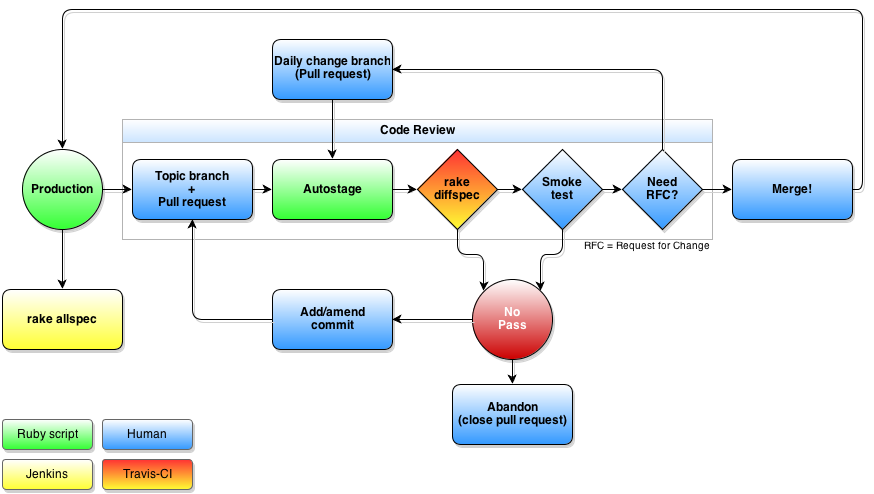

<!SLIDE bullets small transition=shuffle>
# The tool that Luke built

* Cross-platform
* *To be*, not to do
* Describe the *expected state*, let Puppet figure out how to get there

<!SLIDE bullets small transition=toss>
# The tool that Linus built

* Cross-platform
* Strong audit trail
* Lightweight branch for each puppet environment
* Define the *single source of truth*

<!SLIDE center transition=toss>
# Each tool has a role

### Do not cross layers!

<!SLIDE center transition=toss>

# Fail early, fail cheap

<!SLIDE center transition=toss>
# Workflow

<!SLIDE center transition=toss>
# Growth

